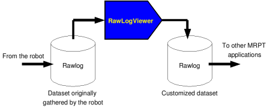
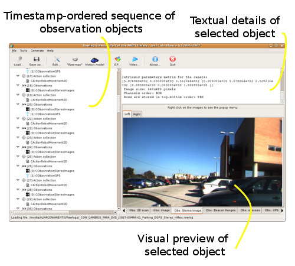
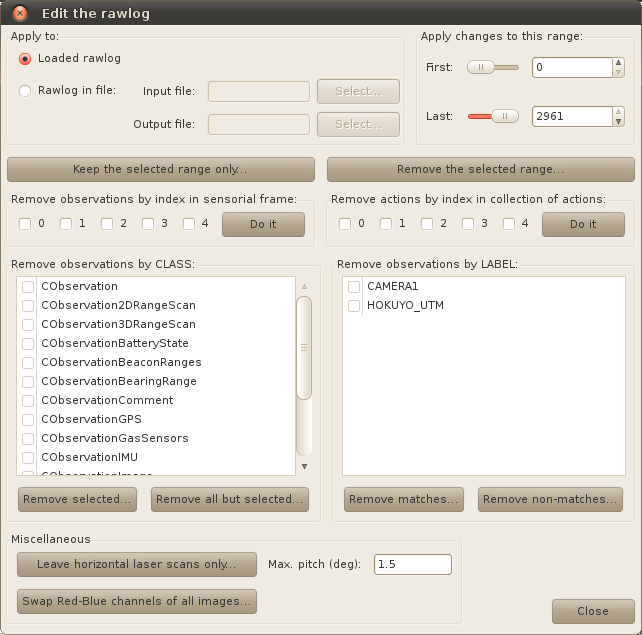
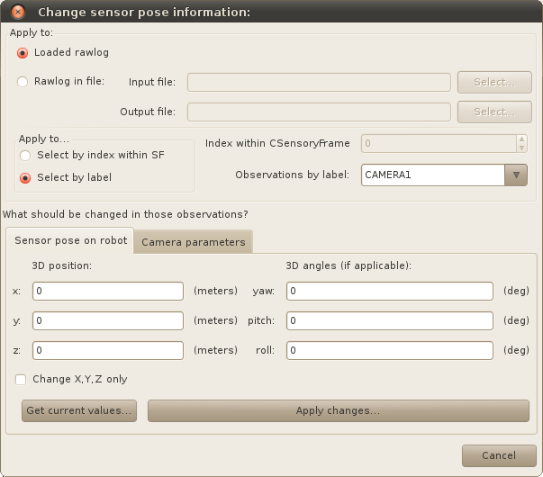
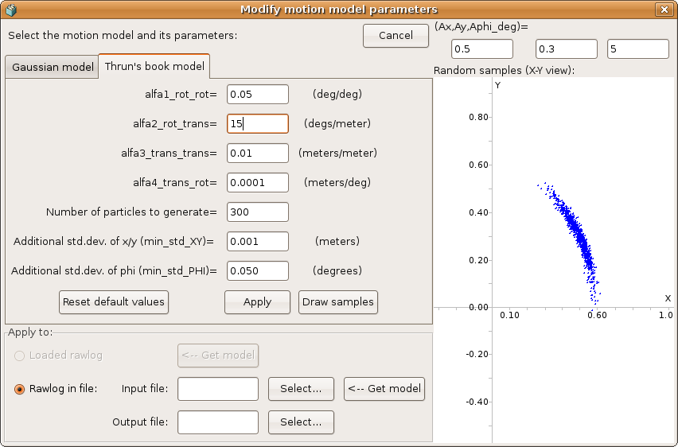
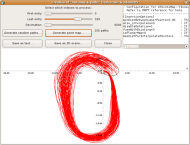
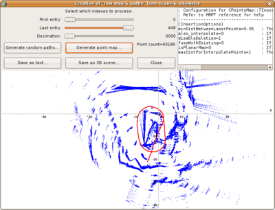
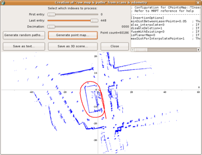

.. _app_RawLogViewer:

====================================================
Application: RawLogViewer
====================================================

.. contents:: :local:

1. Purpose of this program
----------------------------

The main goal of the GUI program RawLogViewer is to allow users to
**quickly inspect**, cut, or modify in many different ways a
given :ref:`Rawlog (datasets)<robotics_file_formats>`  gathered by a robot,
with the idea of preparing it as the input to some other program, typically for
localization (pf-localization) or mapping (kf-slam, rbpf-slam,...):

Examples of typical operations are extracting just a part of a large dataset,
decimating the rawlog if original data was gathered at a very high rate, or
modifying the sensor poses with respect to the robot/vehicle frame of reference.

The program also permits importing and exporting datasets to other formats.
Limited exporting is also implemented into plain text files, e.g. for processing
data in MATLAB. Note that future development of this program will focus on
visualization only, while modification of datasets should preferably be done
by means of the program ``rawlog-edit``.

This video demonstrates RawLogViewer inspecting some datasets with
Velodyne 3D Lidar data, as well as others with 2D lidars and 3D RGB+D cameras:

.. raw:: html

    

        <iframe src="https://www.youtube.com/embed/Dau0ir_L77w" frameborder="0" allowfullscreen style="position: absolute; top: 0; left: 0; width: 100%; height: 100%;"></iframe>
    

Another (older) video demonstrating RawLogViewer inspecting RGB+D datasets grabbed
with Microsoft Kinect:

.. raw:: html

    

        <iframe src="https://www.youtube.com/embed/RZhMZWRplO0" frameborder="0" allowfullscreen style="position: absolute; top: 0; left: 0; width: 100%; height: 100%;"></iframe>
    

2.  Interface description
----------------------------

- Left: The sequence of all the objects stored in the loaded dataset.
  Click on an object to select it and preview its contents on the other
  right-hand spaces.

- Top-right: A textual description of the selected object.

- Bottom-right: For some objects, a visual preview of the observation contents.
  For example, a 2D view of a laser scan, the images of a monocular or stereo
  camera, etc. When no object is selected, this panel displays a summary of
  the entire dataset, including timing information for each sensor.

3. Important manipulations of a rawlog
---------------------------------------

.. note::
    The command-line program ``rawlog-edit`` provides many other manipulation
    opportunities for rawlog datasets.

Cut, selective removals, etc
~~~~~~~~~~~~~~~~~~~~~~~~~~~~~~~

Menu path: “Edit” -> “Edit rawlog…”

Description: This command opens up a dialog with several configurable filters
to remove specific parts of a dataset, either by their position in time,
or by sensor-type or sensor-label.

Changing the position of sensors
~~~~~~~~~~~~~~~~~~~~~~~~~~~~~~~~~

Menu path: “Edit” -> “Change sensor/camera parameters…”

Description: All sensor (observation) objects in a dataset have an associated “pose on the robot”, describing its 6D location on the vehicle frame of reference (e.g. which will be always the origin for hand-held devices). This dialog allows getting and setting this pose to all the objects in a dataset at once. It’s typically used together to sensor labels:

Converting a rawlog format: “observations-only” ==> “actions-sensory frame“
~~~~~~~~~~~~~~~~~~~~~~~~~~~~~~~~~~~~~~~~~~~~~~~~~~~~~~~~~~~~~~~~~~~~~~~~~~~~~~~

Menu path: “Edit” -> “Convert into SF format” -> choose your conversion parameters.

Note: Typically, at least one of the first “actions” will be empty (e.g. without odometry).
Check it out by inspecting rawlog entry number “1” in the tree view.
If it is empty, it is strongly recommended to cut off those first entries.
See how to remove part of a rawlog in section 3.1 above.
Continue inspecting the rawlog and, if satisfied, save it as a new rawlog file.

Converting a rawlog format: “actions-sensory frame” ==> “observations-only“
~~~~~~~~~~~~~~~~~~~~~~~~~~~~~~~~~~~~~~~~~~~~~~~~~~~~~~~~~~~~~~~~~~~~~~~~~~~~~

Menu path: “File” -> “Operations on files” -> “Convert to observations-only rawlog”

4. The “maps and paths generation module” dialog
-----------------------------------------------------

Menu path: “Tools” -> “Open the maps & paths generation module…”

Description: Mostly oriented to datasets with 2D/3D laser scans, this dialog allows
quickly inspecting a map built from unprocessed odometry, useful to gain a first quick
insight of the environment, and the odometry quality.

5. The Scan-Matching (ICP) module
-----------------------------------------------------

This module of the RawLogViewer application is a graphical front-end to the
:ref:`ICP algorithms<tutorial-icp-alignment>` implemented in ``mrpt-slam``.
Basically, two sensory frames (or individual observations) from the
currently-loaded rawlog are aligned using `mrpt::slam::CICP <class_mrpt_slam_CICP.html>`_
allowing the user to tune all parameters at a glance.

So, you can use this module to tune or trial-and-error tests related to ICP.
Optionally, the ICP iterations can be seen visually as an animation.

Note that in the "animate mode" the execution of ICP is intentionally
carried out more slowly to ease the step-by-step visualization,
though the normal operation usually takes a few milliseconds.

In this first experiment we can see how the threshold value for the maximum
distance for establishing a correspondence between the two maps strongly
limits the attainable adjustment that the ICP algorithm can perform from
the **initial position**: in a first trial, a threshold of 0.75m is not
enough to lead the algorithm to convergence, but it does quickly by changing
the threshold to 2.5m:

.. raw:: html

    

        <iframe src="https://www.youtube.com/embed/B_OAlxjDhEM" frameborder="0" allowfullscreen style="position: absolute; top: 0; left: 0; width: 100%; height: 100%;"></iframe>
    

This second video demonstrates the two reference maps that MRPT's ICP
implementation can handle: a map of points, or a grid map.
In this latter case, correspondences are established by matching laser points
to occupied cells in the grid:

.. raw:: html

    

        <iframe src="https://www.youtube.com/embed/WbM8ri7Jk_w" frameborder="0" allowfullscreen style="position: absolute; top: 0; left: 0; width: 100%; height: 100%;"></iframe>
    

6. Actions: odometry and its uncertainty
-----------------------------------------------------

Concepts
~~~~~~~~~~

For the mathematical details of each probabilistic model read:
:ref:`probabilistic_motion_models`.

Modifying the probabilistic motion model
~~~~~~~~~~~~~~~~~~~~~~~~~~~~~~~~~~~~~~~~~~~~~~~

Menu path: Sensors -> Odometry -> Modify motion model...

Description: This dialog allows experimenting with the parameters of two
different probabilistic motion models and changing those parameters for all the odometry increments in the rawlog.

Modeling the actual uncertainty may be critical for some particle filter-based
SLAM methods. As can be seen in the next example, sometimes it is needed to
increase the uncertainty of odometry increments up to the point that the
real hypothesis after closing a loop is included by the probability distribution
of all the potential robot paths:

.. image:: images/Screenshot-GenRandomPaths2.png
   :alt: Screenshot-GenRandomPaths2

Note how the loop closure cannot be correctly detected by a RBPF SLAM method
if the uncertainty in the odometry is over-confident, as in the first of the two images above.

Creating ‘odometry’ from scan-matching
~~~~~~~~~~~~~~~~~~~~~~~~~~~~~~~~~~~~~~~

Menu path: Sensors -> Odometry -> Recalculate actions with ICP...

Description: This operation allows "correcting" the wheels-based odometry
readings by performing ICP-based scan matching between each pair of
consecutive observations.
Note that this operation is only implemented for rawlogs in the “SensoryFrame” format.

7. Browse point cloud sensors (LIDARs, RGBD)
-----------------------------------------------------

This video demonstrates RawLogViewer inspecting some datasets with
Velodyne 3D Lidar data, as well as others with 2D lidars and 3D RGB+D cameras:

.. raw:: html

    

        <iframe src="https://www.youtube.com/embed/Dau0ir_L77w" frameborder="0" allowfullscreen style="position: absolute; top: 0; left: 0; width: 100%; height: 100%;"></iframe>
    

8. Browse images
--------------------

Menu path: Sensors -> Images -> Show images as a video...

Description: This module allows visualizing all existing imaging sensors in
a dataset as a video sequence or just peeking through the entire duration using a scrollbar:

Screenshot-Play_images_in_a_Rawlog_as_a_video

Note that this works for monocular cameras, stereo cameras and the intensity channel of 3D cameras.

9. Generating a ground truth path from rawlogs with 3 RTK GPS
--------------------------------------------------------------

This specifically applies to rawlogs described
in `this paper <https://www.mrpt.org/malaga_dataset_2009>`_.

Instructions:

- Load the rawlog.
- Click the “Raw map” button.
- If desired, mark the desired range of entries to process in the controls on the top.
- Also set a decimation>1 if you don’t mind not to insert all laser scans in
  the 3D map, making the process a bit faster.
- Click “Map from RTK GPS”.
- The map should appear in the main area at the bottom. By hitting
  “Save vehicle path…”, the reconstructed ground truth will be dumped to text files.
