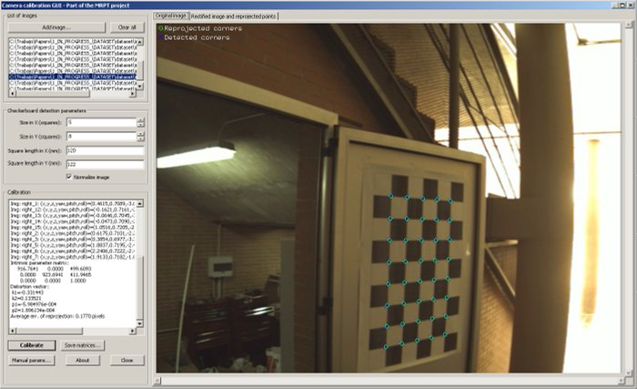
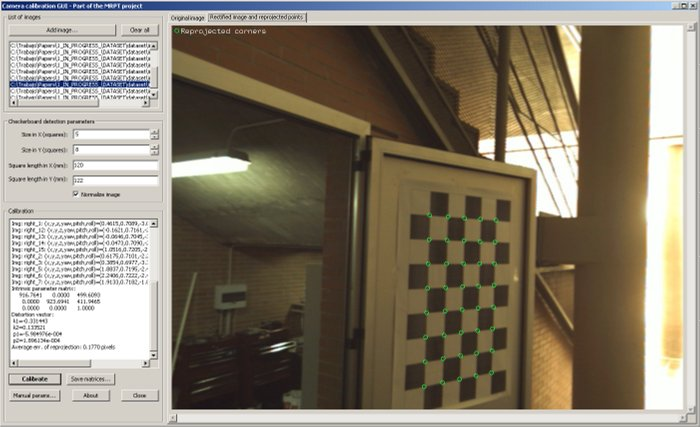
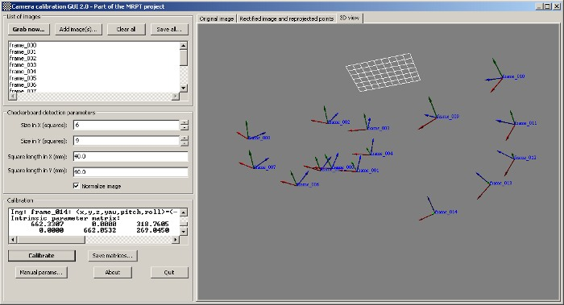

.. _app_camera-calib:

====================================================
Application: camera-calib
====================================================

1. Description
----------------
This GUI program allows users to perform **intrinsic camera parameters calibration**
by capturing several images of a **checkerboard**.
The program allows live grabbing of images as well as selection
of pre-recorded image files.
It also shows the reprojected points, undistorted images and a 3D
view of the reconstructed camera poses.

Supported image sources:

 - All cameras supported by OpenCV (webcams, firewire,…)
 - All cameras supported by FFmpeg (IP cameras,…)
 - Video files (in any format)
 - :ref:`Rawlog files<rawlog_format>`.
 - The stereo Bumblebee camera, for calibration of the individual cameras one at a time.
 - The RGB intensity and IR channels of Microsoft Kinect.

Precompiled binaries of this application can be found [here](download-mrpt.html) for Windows and Linux.

.. note::
    You need to print a checker-board for the calibration, for example `from this web <https://calib.io/pages/camera-calibration-pattern-generator>`_
    (remember to select `checkerboard` type).

2. Video tutorial
--------------------

This (old!) video tutorial explains how to use ``camera-calib`` to calibrate
a camera with a checkerboard. The program captures the images of the pattern
on the fly and finally computes the camera matrix and the distortion parameters,
which can be saved to plain text files (or to a YAML file):

.. raw:: html

    

        <iframe src="https://www.youtube.com/embed/BkZkq6zPwQM" frameborder="0" allowfullscreen style="position: absolute; top: 0; left: 0; width: 100%; height: 100%;"></iframe>
    

3. Screenshots
-------------------

The detected checkerboard.

The undistorted images

.. image:: images/camera-calibration_kinect_ir_channel-1024x558.jpg
   :alt: Calibrating the infrarred (IR) channel camera of a Kinect.

Calibrating the infrarred (IR) channel camera of a Kinect.

The final 3D reconstruction of the camera locations around the checkerboard.
