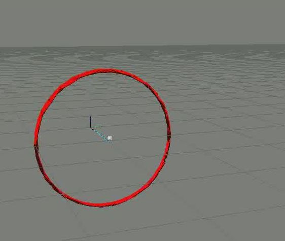

.. _ro_slam_solutions:

=================================================
Range-only Localization and Mapping Solutions
=================================================

.. contents:: :local:

1. Range-only SLAM
====================

MRPT at present offers one SLAM solution for RO-SLAM, integrated into the
RBPF-SLAM framework. Refer to `this tutorial <https://www.mrpt.org/tutorials/slam-algorithms/rangeonly_slam/>`_
for more details on the different methods available.

Users can employ 2D or 3D poses in RBPF-SLAM, but notice that RO-SLAM with a RBPF
requires a decent odometry as input, which can comprise 2D or 3D robot motion
actions.

2. Range-only Localization
==========================

There are two implementations:

pf-localization
---------------------

The `pf-localization application <https://www.mrpt.org/list-of-mrpt-apps/application-pf-localization/>`_
is a CLI to the underlying C++ class from the library `mrpt::apps <group_mrpt_apps_grp.html>`_.

Users can employ 2D or 3D odometry as input for 2D or 3D motion estimation. If
no odometry is available, using a no-motion mean value with a large uncertainty
should work.

The CLI application works with offline data only, for online use, please refer
to the underlying class in `mrpt::apps <group_mrpt_apps_grp.html>`_ 
or use the even most low-level classes:

- `mrpt::slam::CMonteCarloLocalization2D <class_mrpt_slam_CMonteCarloLocalization2D.html>`_: For robots
  moving in 2D, with SE(2) poses (x,y,phi)

- `mrpt::slam::CMonteCarloLocalization3D <class_mrpt_slam_CMonteCarloLocalization3D.html>`_: For robots
  moving in 3D space, with SE(3) poses (x,y,z,yaw,pitch,roll)

ro-localization
---------------------

The `ro-localization application <https://www.mrpt.org/list-of-mrpt-apps/application-ro-localization/>`_
is exactly like pf-localization above, but with two differences:

- It's available for 2D only (at present).
  
- It defines an extended state vector (at each particle) with an estimate of the current bias of each beacon/anchor.

If your sensors do NOT suffer of bias with often, abrupt large changes, the regular
PF solution should be preferred (faster, simpler).
