.. _supported-sensors:

####################
Supported sensors
####################

This page contains a list of \ **supported sensors**, along example
configuration blocks for those based on
the  mrpt::hwdrivers::CGenericSensor interface.
All hardware and sensor-related classes can be found in
the \ `mrpt-hwdrivers
library <mrpt-hwdrivers.html>`__,
which contains
the \ `mrpt::hwdrivers <namespacemrpt_1_1hwdrivers.html>`__ namespace.
See also
the \ `rawlog-grabber <application-rawlog-grabber.html>`__ application.
Unless specifically noted, all devices are supported under \ **both
Windows and Linux**, with only some (for now) supported on MacOS.

.. contents:: Contents
   :local:
   :backlinks: none

1. 3D range cameras
-------------------

Any 3D camera supported by OpenNI2
~~~~~~~~~~~~~~~~~~~~~~~~~~~~~~~~~~~~~~~

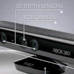

The C++ interface is implemented in the
class \ `mrpt::hwdrivers::OpenNI2Sensor <classmrpt_1_1hwdrivers_1_1_c_open_n_i2_sensor.html>`__.

Xbox Kinect (RGB+D camera)
~~~~~~~~~~~~~~~~~~~~~~~~~~~~~~~

The C++ interface is implemented in the
class \ `mrpt::hwdrivers::CKinect <classmrpt_1_1hwdrivers_1_1_c_kinect.html>`__.
See \ `this page <http://www.mrpt.org/Kinect_and_MRPT>`__ for more
information, demo videos and example code.

SwissRanger SR3000/4000 (legacy)
~~~~~~~~~~~~~~~~~~~~~~~~~~~~~~~~~~

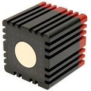

The C++ interface is implemented in the
class \ `mrpt::hwdrivers::CSwissRanger3DCamera <classmrpt_1_1hwdrivers_1_1_c_swiss_ranger3_d_camera.html>`__.
See the \ `page of the demo
application <example-swissranger-sr4000-3d-camera-demo-application/>`__ for
more information and a demo video.

Manufacturer: mesa-imaging

2. 2D laser scanners
--------------------

SICK LMS 2XX
~~~~~~~~~~~~~~~~~

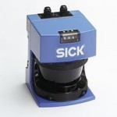

SICK LMS2XX laser scanners are supported by the
class \ `mrpt::hwdrivers::CSickLaserSerial <classmrpt_1_1hwdrivers_1_1_c_sick_laser_serial.html>`__,
which supports a wide variety of configurations (different aperture
angles, 0.25/0.50/1.0 degrees separation between rays,…) and operating
baud rates, including 500Kbauds for the USB2SERIAL converters that allow
that configuration (based on FTDI chips).

SICK LMS 100 (Ethernet)
~~~~~~~~~~~~~~~~~~~~~~~~~~~~

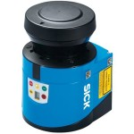

SICK LMS 100 laser scanners with Ethernet interface are supported by the
class \ `mrpt::hwdrivers::CLMS100Eth <classmrpt_1_1hwdrivers_1_1_c_l_m_s100_eth.html>`__.

SICK TiM 55x/56x (Ethernet)
~~~~~~~~~~~~~~~~~~~~~~~~~~~~~~~~~~~~~~~~~

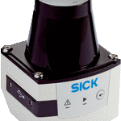

SICK TiM laser scanners with Ethernet interface are supported by the
class mrpt::hwdrivers::CSICKTim561Eth.

Note: Since MRPT 1.9.9.

Hokuyo URG/UTM/UXM
~~~~~~~~~~~~~~~~~~~~~~~

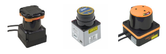

A wide range of Hokuyo laser scanners are supported by one single class,
the `mrpt::hwdrivers::CHokuyoURG <classmrpt_1_1hwdrivers_1_1_c_hokuyo_u_r_g.html>`__.
See also the example
named `HOKUYO_laser_test <example_hokuyo_urgutm_laser_scanner.html>`__.

See the manufacturer website: \ http://www.hokuyo-aut.jp/ 

Ibeo Automotive Laser Scanners
~~~~~~~~~~~~~~~~~~~~~~~~~~~~~~~~~~~

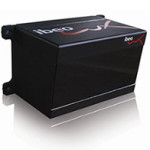

Ibeo LUX laser scanner, Ethernet-interfaced, is supported since MRPT
0.9.4 through the class \ `mrpt::hwdrivers::CIbeoLuxETH <classmrpt_1_1hwdrivers_1_1_c_ibeo_lux_e_t_h.html>`__.

See the manufacturer website: \ http://www.ibeo-as.com/ 

RoboPeak RP-LIDAR laser Scanners
~~~~~~~~~~~~~~~~~~~~~~~~~~~~~~~~~~~~~

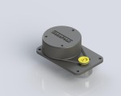

The low-cost RP-LIDAR sensor, USB-interfaced, is supported since MRPT
1.2.2 through the
class \ `mrpt::hwdrivers::CRobotPeakLidar <classmrpt_1_1hwdrivers_1_1_c_robo_peak_lidar.html>`__.

See the manufacturer website: \ http://rplidar.robopeak.com/

3. 3D LIDARs
-------------

Velodyne
~~~~~~~~~~~~~

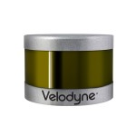

`Velodyne 3D LIDARs <https://velodynelidar.com/>`__ are supported by
means of:

-  `mrpt::hwdrivers::CVelodyneScanner <classmrpt_1_1hwdrivers_1_1_c_velodyne_scanner.html>`__
-  `mrpt::obs::CObservationVelodyne <classmrpt_1_1obs_1_1_c_observation_velodyne_scan.html>`__
-  The new
   application \ `velodyne-view <http://www.mrpt.org/list-of-mrpt-apps/application-velodyne-view/>`__
-  Visualization of datasets
   in \ `RawLogViewer <http://www.mrpt.org/list-of-mrpt-apps/rawlogviewer/>`__
-  Grab of LiDAR scans, simultaneously to other sensors, is possible
   via \ `rawlog-grabber <http://www.mrpt.org/list-of-mrpt-apps/application-rawlog-grabber/>`__

4. Cameras
----------

**Important: **\ MRPT provides a universal class capable of managing all
the following cameras with a common interface, deciding which camera to
open at runtime and converting the images from all the cameras to one
single format, the OpenCV IplImage format. See the
class \ `mrpt::hwdrivers::CCameraSensor <classmrpt_1_1hwdrivers_1_1_c_camera_sensor.html>`__.

Monocular and stereo cameras
~~~~~~~~~~~~~~~~~~~~~~~~~~~~~~~~~

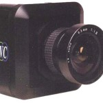

Apart from the generic CCameraSensor class, MRPT offers this
implementation-specific classes:

-  All \ **cameras supported by OpenCV** are accessible by means of the
   class \ `mrpt::hwdrivers::CImageGrabber_OpenCV <classmrpt_1_1hwdrivers_1_1_c_image_grabber___open_c_v.html>`__.
-  **Firewire cameras** are specifically supported in GNU/Linux by means
   of the libdc1394 library and the
   class \ `mrpt::hwdrivers::CImageGrabber_dc1394 <classmrpt_1_1hwdrivers_1_1_c_image_grabber__dc1394.html>`__.
-  All \ **Point Grey Research (PGR) cameras** supported
   by \ `FlyCapture2 <http://www.ptgrey.com/flycapture-sdk>`__ can be
   read with the
   class \ `mrpt::hwdrivers::CImageGrabber_FlyCapture2 <classmrpt_1_1hwdrivers_1_1_c_image_grabber___fly_capture2.html>`__ (Requires:
   MRPT 1.0.3). \ **Stereo pairs** built from two independent PGR
   cameras are supported
   via \ `mrpt::hwdrivers::CCameraSensor <classmrpt_1_1hwdrivers_1_1_c_camera_sensor.html>`__.

Bumblebee/Bumblebee2 Stereo cameras
~~~~~~~~~~~~~~~~~~~~~~~~~~~~~~~~~~~~~~~~

Bumblebee stereo cameras are supported in MRPT in both Windows &
GNU/Linux by means of the manufacturer API and the libdc1394 libraries,
respectively. The C++ interface is the same in any case, and it’s
implemented in the
class\ `mrpt::hwdrivers::CStereoGrabber_Bumblebee_libdc1394 <classmrpt_1_1hwdrivers_1_1_c_stereo_grabber___bumblebee__libdc1394.html>`__.

Videre Stereo cameras
~~~~~~~~~~~~~~~~~~~~~~~~~~

Videre stereo cameras are supported in MRPT (since MRPT 0.9.1) for
GNU/Linux only for now, by means of the manufacturer SVS API. The C++
interface is implemented in the
class \ `mrpt::hwdrivers::CStereoGrabber_SVS <classmrpt_1_1hwdrivers_1_1_c_stereo_grabber___s_v_s.html>`__.

IP cameras and video files
~~~~~~~~~~~~~~~~~~~~~~~~~~~~~~~

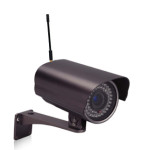

Both IP cameras and offline video files (in many common video formats
and codecs) are supported by means of the ffmpeg libraries, within the
MRPT
class \ `mrpt::hwdrivers::CFFMPEG_InputStream <classmrpt_1_1hwdrivers_1_1_c_f_f_m_p_e_g___input_stream.html>`__.

5. Inertial Sensors (IMUs)
----------------------------

5.1. xSens MTi Inertial Unit (IMU) – 3rd generation devices
~~~~~~~~~~~~~~~~~~~~~~~~~~~~~~~~~~~~~~~~~~~~~~~~~~~~~~~~~~~

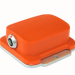

The interface to this sensor is implemented in the
class \ `mrpt::hwdrivers::CIMUXSens <classmrpt_1_1hwdrivers_1_1_c_i_m_u_x_sens.html>`__.

5.2. xSens MTi Inertial Units (IMUs) – 4th generation devices
~~~~~~~~~~~~~~~~~~~~~~~~~~~~~~~~~~~~~~~~~~~~~~~~~~~~~~~~~~~~~

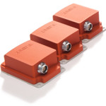

The interface to this sensor is implemented in the
class \ `mrpt::hwdrivers::CIMUXSens_MT4 <classmrpt_1_1hwdrivers_1_1_c_i_m_u_x_sens___m_t4.html>`__.

Required: MRPT 1.0.3

KVH DSP3000 (Fiber Optic Gyro)
~~~~~~~~~~~~~~~~~~~~~~~~~~~~~~~~~~~

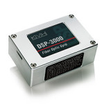

A precise fiber optic gyro. The interface to this sensor is implemented
in the
class \ `mrpt::hwdrivers::CGyroKVHDSP3000 <classmrpt_1_1hwdrivers_1_1_c_gyro_k_v_h_d_s_p3000.html>`__.

See the manufacturer
website: \ `http://www.kvh.com/…/Fiber-Optic-Gyros/DSP-3000.aspx <http://www.kvh.com/Military-and-Government/Gyros-Inertial-Systems-and-Compasses/Gyros-IMUs-and-INS/Fiber-Optic-Gyros/DSP-3000.aspx>`__ 

6. GPS receivers
----------------

Parser of standard NMEA commands and Novatel binary frames
~~~~~~~~~~~~~~~~~~~~~~~~~~~~~~~~~~~~~~~~~~~~~~~~~~~~~~~~~~~~~~~

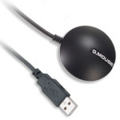

An implementation of a parser of NMEA commands from a wide range of GPS
devices, also capable of receiving Novatel frames (this latter feature,
only available in MRPT 1.3.3 or newer), can be found in the
class \ `mrpt::hwdrivers::CGPSInterface <classmrpt_1_1hwdrivers_1_1_c_g_p_s_interface.html>`__.

RTK corrections via NTRIP
~~~~~~~~~~~~~~~~~~~~~~~~~~~~~~

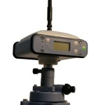

You can use advanced RTK GPS receivers with MRPT. For that, MRPT
includes a class that receives NTRIP RTK corrections from an Internet
server and sends them to a serial port connected to the GPS receiver.
See \ `mrpt::hwdrivers::CNTRIPEmitter <classmrpt_1_1hwdrivers_1_1_c_n_t_r_i_p_emitter.html>`__.

7. Activemedia robotic bases (All ARIA-compatible bases)
--------------------------------------------------------

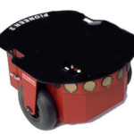

Access to all ARIA-based mobile robotic bases is done via the C++
class \ `mrpt::hwdrivers::CActivMediaRobotBase <http://mrpt.ual.es/reference/1.4.0/classmrpt_1_1hwdrivers_1_1_c_activ_media_robot_base.html>`__,
which implements basic mobility functions as well as sonars and other
sensors. Since MRPT carries its own embedded version of ARIA, you won’t
need any software or library previously installed in your system to use
this class.

Note: Support for these robots was dropped in MRPT 1.5.3. Use older
versions if you need it with MRPT. Ten years ago, it might make sense to
integrate ARIA into MRPT, but nowadays it’s probably more practical to
use ARIA ROS packages to access robots instead of directly using MRPT.

8. Rovio mobile robot/webcam
----------------------------

An interface to this mobile robot, equipped with an IP camera, is
implemented in the C++
class \ `mrpt::hwdrivers::CRovio <classmrpt_1_1hwdrivers_1_1_c_rovio.html>`__.

See the manufacturer
web: \ http://www.wowwee.com/en/products/tech/telepresence/rovio/rovio 

9. Joysticks
------------

A cross-platform and very simple interface to joysticks is provided via
the
class \ `mrpt::hwdrivers::CJoystick <classmrpt_1_1hwdrivers_1_1_c_joystick.html>`__.

10. Pan and Tilt Units
----------------------

Direct Perception Pan-Tilt-Unit (PTU)
~~~~~~~~~~~~~~~~~~~~~~~~~~~~~~~~~~~~~~~~~~~

An interface to this PTU model is implemented in the C++
class \ `mrpt::hwdrivers::CPtuDPerception <classmrpt_1_1hwdrivers_1_1_c_ptu_d_perception.html>`__.

Micos Tilt-Unit
~~~~~~~~~~~~~~~~~~~~~

An interface to the precision “rotation stage DT-80”, by MICOS. See the
C++
class \ `mrpt::hwdrivers::CTuMicos <classmrpt_1_1hwdrivers_1_1_c_tu_micos.html>`__.

See the manufacturer
website: http://www.micos-online.com/web2/en/1,5,120,dt80.html

11. Range-only or RFID sensors
------------------------------

Impinj’s RFID Speedway Revolution Reader
~~~~~~~~~~~~~~~~~~~~~~~~~~~~~~~~~~~~~~~~~~~~~~

This sensor is supported by the MRPT
class \ `mrpt::hwdrivers::CImpinfRFID <classmrpt_1_1hwdrivers_1_1_c_impinj_r_f_i_d.html>`__.
Note however that this sensor requires an external program outside of
MRPT for communications (refer to the Doxygen documentation of the C++
class).

See the specifications of the sensor
in: \ http://www.impinj.com/products/speedway/

12. Generic I/O boards
----------------------

Phidgets boards
~~~~~~~~~~~~~~~~~~~~~

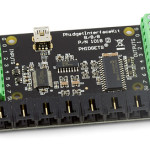

Phidgets Inc.’s board “PhidgetInterfaceKit 8/8/8” is supported by
class \ `mrpt::hwdrivers::CPhidgetInterfaceKitProximitySensors <classmrpt_1_1hwdrivers_1_1_c_phidget_interface_kit_proximity_sensors.html>`__.

Manufacturer web: \ http://www.phidgets.com/products.php?product_id=1018

National Instruments boards compatible with DAQmx Base
~~~~~~~~~~~~~~~~~~~~~~~~~~~~~~~~~~~~~~~~~~~~~~~~~~~~~~~~~~~~

| See
  class: \ `mrpt::hwdrivers::CNationalInstrumentsDAQ <classmrpt_1_1hwdrivers_1_1_c_national_instruments_d_a_q.html>`__
| Read \ `this blog
  entry <https://www.mrpt.org/NI_DAQmx_Base_in_openSUSE_64bit>`__ about
  the limitations of NI PCI/USB DAQ boards in 64bit Linux distributions.

Note: Since MRPT 1.0.3

13. Gas and Wind sensing devices
--------------------------------

MiniRAE Lite photoionization detector (PID)
~~~~~~~~~~~~~~~~~~~~~~~~~~~~~~~~~~~~~~~~~~~~~~~~~

This sensor for fast detection of volatile organic compounds (VOC) is
supported by the software driver C++
class \ `mrpt::hwdrivers::CRaePID <classmrpt_1_1hwdrivers_1_1_c_rae_p_i_d.html>`__

Manufacturer web: \ http://www.raesystems.com/products/minirae-lite

Gill WindSonic Wind sensor
~~~~~~~~~~~~~~~~~~~~~~~~~~~~~~~~

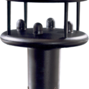

Speed and direction ultrasonic wind sensor. Supported by the software
driver C++
class \ `mrpt::hwdrivers::CGillAnemometer <classmrpt_1_1hwdrivers_1_1_c_gill_anemometer.html>`__ 

Manufacturer
web: \ http://gillinstruments.com/products/anemometer/windsonic.htm
