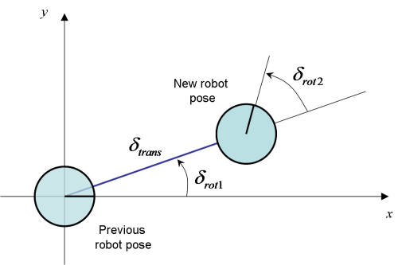
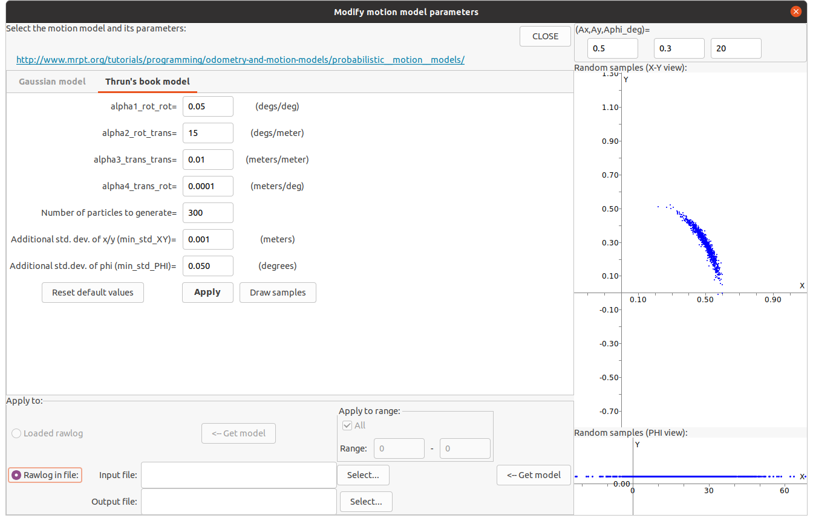

.. _tutorial-motion-models:

===========================================================================
Probabilistic motion models
===========================================================================

.. contents:: :local:

Overview
========================================

For data fusion, SLAM, and localization 
(for example using a particle filter such as the well-known ``amcl`` Adaptive MonteCarlo Localization), 
we need to handle the uncertainty in SE(2) or SE(3) pose increments.

Within a particle filter, pose samples are propagated at each time step using some 
given proposal distribution. A common approach for mobile robots is taking the
probabilistic motion model directly as this proposal.
In EKF or other graphical models (factor graphs) we would also 
need a probability distribution for pose increments, in this case, 
typically a parametric unimodal one such as the multivariate Gaussian distribution, 
defined via one mean pose and one covariance matrix for the "noise" (uncertainty).

In MRPT there are two **motion models** for probabilistic motion in SE(2), and 
one for SE(3), with the relevant classes being
`mrpt::obs::CActionRobotMovement2D <class_mrpt_obs_CActionRobotMovement2D.html>`_
and
`mrpt::obs::CActionRobotMovement3D <class_mrpt_obs_CActionRobotMovement3D.html>`_
, respectively. 

The **next video** shows a comparison of pose samples propagated using the **Gaussian** (left)
and the **Thrun's sample-based** (right) motion models:

.. raw:: html

    

    <video controls autoplay muted loop src="https://mrpt.github.io/imgs/motion_model_mmGauss.mp4" type="video/mp4" style="width: 49%;"></video>
    <video controls autoplay muted loop src="https://mrpt.github.io/imgs/motion_model_mmThrun.mp4" type="video/mp4" style="width: 49%;"></video>
    

The rest of this page explains the **different theoretical models and equations** for
those motion models. A C++ API usage example would be:

.. code-block:: cpp

    using namespace mrpt::literals; // _deg

    // Select the motion model and its parameters:
    mrpt::obs::CActionRobotMovement2D::TMotionModelOptions opts;
    opts.modelSelection = mrpt::obs::CActionRobotMovement2D::mmThrun;
    opts.thrunModel.alfa3_trans_trans = 0.10f;

    // The odometry pose increment:
    mrpt::poses::CPose2D actualOdometryReading(0.20, 0.05, 1.2_deg );

    // Create the probability density distribution (PDF) from a 2D odometry reading:
    mrpt::obs::CActionRobotMovement2D actMov;
    actMov.computeFromOdometry( actualOdometryReading, opts );
    
    // Next, for example, draw one sample from the PDF:
    mrpt::poses::CPose2D sample;
    actMov.drawSingleSample( sample );

Gaussian probabilistic motion model
========================================

.. note::

    This model is used for SE(2) pose increments when:

        opts.modelSelection = `mrpt::obs::CActionRobotMovement2D <class_mrpt_obs_CActionRobotMovement2D.html>`_::mmGaussian;

Assume the odometry is read as incremental changes in the 2D robot pose. The odometry readings are denoted as:

.. math::

   \mathbf{u} = \left( \Delta^{odo}_x ~ \Delta^{odo}_y ~ \Delta^{odo}_\phi \right)

The model for these variables is:

Following :cite:`eliazar2004learning`, 
the equations that relate the prior robot pose :math:`\left( x ~ y ~ \phi \right)` 
and the new pose :math:`\left( x' ~ y' ~ \phi' \right)` after the incremental change are:

.. math::

   \left(
    \begin{array}{c}
    x' \\ y' \\ \phi'
    \end{array}
    \right)
    =
    \left(
    \begin{array}{c}
    x \\ y \\ \phi
    \end{array}
    \right)
    +
    \left(
    \begin{array}{ccc}
    \cos(\phi+\frac{\Delta^{odo}_\phi}{2}) & -\sin(\phi+\frac{\Delta^{odo}_\phi}{2}) & 0  \\
    \sin(\phi+\frac{\Delta^{odo}_\phi}{2}) & \cos(\phi+\frac{\Delta^{odo}_\phi}{2}) &  0  \\
    0 & 0 & 1
    \end{array}
    \right)
    \left(
    \begin{array}{c}
    \Delta^{odo}_x \\ \Delta^{odo}_y \\ \Delta^{odo}_\phi
    \end{array}
    \right)

Within the context of a particle filter for localization, the aim at this point
will be to obtain a multivariate Gaussian distribution of the new pose
given a prior pose with a perfectly-known value (it is the particle being propagated).
In this case we can just model how to draw samples from a prior pose at the origin (:math:`(0~0~0)`),
and then the samples can be composed using the actual prior pose.

Using this simplification:

.. math::

   \left(
    \begin{array}{c}
    x' \\ y' \\ \phi'
    \end{array}
    \right)
    =
    \left(
    \begin{array}{ccc}
    \cos \frac{\Delta^{odo}_\phi}{2} & -\sin \frac{\Delta^{odo}_\phi}{2} & 0 \\
    \sin \frac{\Delta^{odo}_\phi}{2} & \cos \frac{\Delta^{odo}_\phi}{2} & 0  \\
    0 &  0 & 1
    \end{array}
    \right)
    \left(
    \begin{array}{c}
    \Delta^{odo}_x \\ \Delta^{odo}_y \\ \Delta^{odo}_\phi
    \end{array}
    \right)
    =
    H
    \left(
    \begin{array}{c}
    \Delta^{odo}_x \\ \Delta^{odo}_y \\ \Delta^{odo}_\phi
    \end{array}
    \right)

The mean of the Gaussian can be simply computed from the composition of the prior and the
odometry increment. For the covariance, we need to estimate the variances of the three variables
of the odometry increment. We model them as having independent, zero-mean Gaussian errors.
The errors will be composed of terms that capture imperfect odometry and potential drift effects.
We denote as :math:`\Sigma` the diagonal matrix having the three variances of the odometry variables,
modeled as:

.. math::

   \begin{array}{l}
    \sigma_{\Delta^{odo}_x} = \sigma_{\Delta^{odo}_y} = \sigma^{min}_{xy} + \alpha_1 \sqrt{ (\Delta^{odo}_x)^2 + (\Delta^{odo}_y)^2} + \alpha_2 | \Delta^{odo}_\phi | \\
    \sigma_{\Delta^{odo}_\phi} = \sigma^{min}_{\phi} + \alpha_3 \sqrt{ (\Delta^{odo}_x)^2 + (\Delta^{odo}_y)^2} + \alpha_4 | \Delta^{odo}_\phi |
    \end{array}

The default parameters (loaded in the constructor and available in RawLogViewer) are:

.. math::

   \begin{array}{rl}
    \alpha_1 &=&  0.05 ~ meters/meter \\
    \alpha_2 &=&  0.001 ~ meters/degree \\
    \alpha_3 &=&  5 ~ degrees/meter \\
    \alpha_4 &=&  0.05 ~ degrees/degree \\
    \sigma^{min}_{xy} &=&  0.01 ~ meters \\
    \sigma^{min}_{\phi} &=&  0.20 ~ degrees
    \end{array}

And finally, the covariance of the new pose after the odometry increment :math:`C` is computed by means of:

.. math::

   C = J ~ \Sigma ~ J^t

where J stands for the Jacobian of H.
See :cite:`arras1998introduction` for a derivation of this formula for error propagation.

Sampling-based model for planar motion
===========================================

.. note::

    This model is used for SE(2) pose increments when:

        opts.modelSelection = `mrpt::obs::CActionRobotMovement2D <class_mrpt_obs_CActionRobotMovement2D.html>`_::mmThrun;

As above, denote the odometry readings as :math:`\left( \Delta^{odo}_x ~ \Delta^{odo}_y ~ \Delta^{odo}_\phi \right)`,
and let's assume that the prior robot pose is :math:`(0~0~0)`, which means that we want to draw samples
of the robot increment, not the final robot pose (to simplify the equations without loss of generality).
Then, the new robot pose, which we want to draw samples from is:

.. math::

   \left(
    \begin{array}{c}
    x' \\ y' \\ \phi'
    \end{array}
    \right)
    =
    \left(
    \begin{array}{ccc}
    \cos \hat\delta_{rot1} ~   ~ 0 ~   ~ 0 ~ \\
    \sin \hat\delta_{rot1} ~   ~ 0 ~   ~ 0 ~ \\
    0 ~   ~ 1 ~   ~ 1
    \end{array}
    \right)
    \left(
    \begin{array}{c}
    \hat\delta_{trans} \\ \hat\delta_{rot1} \\ \hat\delta_{rot2}
    \end{array}
    \right)

where the variables correspond to the robot pose increment as is shown in the figure:

Here, the variables :math:`\hat\delta_{trans}`, :math:`\hat\delta_{rot1}` and :math:`\hat\delta_{rot2}`
are the result of adding a Gaussian, zero-mean random noise to the actual odometry readings:

.. math::

   \begin{array}{cc}
    \hat\delta_{trans} =  \delta_{trans} + \epsilon_{trans} ~~~~~~~~ \epsilon_{trans} \sim \mathcal{N}(0, \sigma^2_{trans}) \\
    \hat\delta_{rot1} =  \delta_{rot1} + \epsilon_{rot1} ~~~~~~~~ \epsilon_{rot1} \sim \mathcal{N}(0, \sigma^2_{rot1}) \\
    \hat\delta_{rot2} =  \delta_{rot2} + \epsilon_{rot2} ~~~~~~~~ \epsilon_{rot2} \sim \mathcal{N}(0, \sigma^2_{rot2})
    \end{array}

The model described in :cite:`thrun2005probabilistic` employs the following approximations for
the values of the standard deviations required for the equations above:

.. math::

   \begin{array}{rl}
    \sigma_{rot1} &=&  \alpha_1 |\delta_{rot1}| + \alpha_2 \delta_{trans} \\
    \sigma_{trans} &=&  \alpha_3 \delta_{trans} + \alpha_4 ( |\delta_{rot1}| + |\delta_{rot2}| ) \\
    \sigma_{rot2} &=&  \alpha_1 |\delta_{rot2}| + \alpha_2 \delta_{trans}
    \end{array}

The MRPT implementation of this model includes an additional optional 
(white, additive Gaussian) noise
which may be added to each pose component (:math:`x,y,\phi`) to
prevent that a null odometry increment leads to absolute no motion for a set of particles,
which may lead to particle filter degeneration.

The next figure illustrates an example of the "banana shaped distribution", which 
comes out from this model for large values of :math:`\alpha_2` (a very large "slippage"),
generated with :ref:`app_RawLogViewer`:

Sampling-based model for 3D motion
===========================================

.. note::

    This model is used for SE(3) pose increments when:

        opts.modelSelection = `mrpt::obs::CActionRobotMovement3D <class_mrpt_obs_CActionRobotMovement3D.html>`_::mm6DOF;

MRPT also implements a sampling-based algorithm to estimate the equivalent Gaussian distribution of a set of samples
generated from a raw SE(3) pose increment, based on :cite:`ballardini2012effective`. 
Refer to the paper, and to the implementation source code of `mrpt::obs::CActionRobotMovement3D <class_mrpt_obs_CActionRobotMovement3D.html>`_
for further details.
