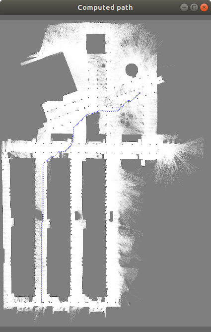

.. _tutorial_motion_planning:

############################
Motion planning
############################

.. note::
    For more advanced motion planning algorithms,
    refer to the `selfdriving library <https://github.com/jlblancoc/selfdriving>`_.

.. contents:: :local:

1. Path planning for circular robots and 2D grid maps
------------------------------------------------------
The basic `value iteration algorithm <https://en.wikipedia.org/wiki/Markov_decision_process#Value_iteration>`_
for searching shortest paths is implemented in MRPT for circular robots and obstacles described by means of 
occupancy grids in the class `mrpt::nav::PlannerSimple2D <class_mrpt_nav_PlannerSimple2D.html>`_.

The method comprises two steps:

- Growth of the obstacles by the robot radius. This assure that just one single free cell is enough for the robot to move without collision.

- The value iteration algorithm, starting at the source position, increase iteratively the area covered by shortest paths until the target cell is reached.
Note that this is a very simple method, not suitable for robots with shapes very different from circular and/or moving in cluttered environments.
For those cases, see the obstacle avoidance methods above.

Using this planner requires declaring the gridmap, the mrpt::nav::PlannerSimple2D object, setting the robot radius,
and invoking `mrpt::nav::PlannerSimple2D::computePath()`.
See the complete example source code `here <page_nav_circ_robot_path_planning.html>`_.

2. RRT path planning
--------------------------

3. Obstacle avoidance (reactive navigation)
------------------------------------------------

See: https://www.mrpt.org/Obstacle_avoidance
