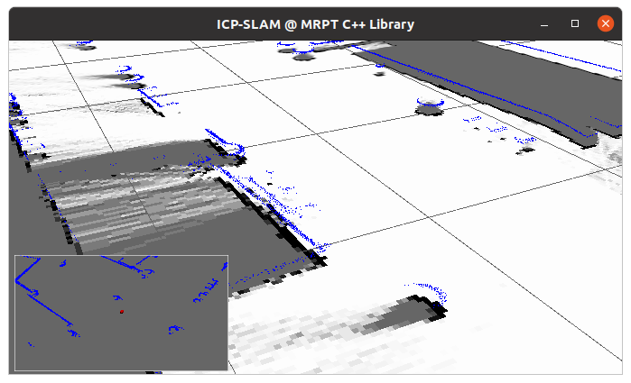

.. _tutorial-mrpt-maps-model:

===========================================================================
MRPT design of map classes
===========================================================================

.. contents:: :local:

1. Maps in mobile robotics and in MRPT
========================================

In mobile robotics, a "map" is any representation of the external world useful
for the robot to achieve its tasks. 
In particular, localization and navigation both require some kind of "map"
to refer to **places**.

At the top conceptual level, maps can be classified as either 
metrical (i.e. distances, areas) or
topological (i.e. just the connectivity between the different areas).
MRPT focuses on **metric maps**.

All metric maps in MRPT inherit from the common interface
`mrpt::maps::CMetricMap <class_mrpt_maps_CMetricMap.html>`_
to ease polymorphism and generic programming.

.. note::
   The base virtual **class** `mrpt::maps::CMetricMap <class_mrpt_maps_CMetricMap.html>`_
   is defined in the **library** `mrpt-obs <group_mrpt_obs_grp.html>`_ for convenience,
   but most actual maps are implemented in the library `mrpt-maps <group_mrpt_maps_grp.html>`_

2. Why only one map?
======================

To ease even more the implementation of generic mapping or SLAM algorithms,
MRPT defines the "**multi-metric map**".
This class offers the interface of a regular metric map, but it can hold 
internally **an arbitrary number of other metric maps**.

To realize of the power and simplicity of this approach, imagine programming
a method which insert scans from 3 laser range finders into a 3D point map
(so, a point cloud is built incrementally).
By just replacing the point map by a multi-metric map, we can now build
the point cloud and, at our choice, three occupancy grid maps, once for each height, 
or an additional 3D octomap, for example.

The original code would need no changes at all.

This is the reason of calling the MRPT map model "hierarchical", 
in the sense that one map (the "multi-metric map") propagates all
the calls to its "children maps".

Localization (e.g. SE(2) or SE(3) particle-filter localization) also benefits
from this model, by automatically **merging all sources of information** from
all the metric maps to evaluate the point-wise likelihood function required
by this localization approach. In other words: in MRPT you can use either a
simple 2D gridmap to localize your robot, or a much richer representation
like a 3D point cloud, several 2D grids (e.g. at different heights),
a Wi-Fi signal strength map, gas concentration maps, floor reflectivity,
or define your own map layer.

3. Metric maps classes
=======================

It is recommended to start reading the documentation for the multi-metric map class
`mrpt::maps::CMultiMetricMap <class_mrpt_maps_CMultiMetricMap.html>`_, which
enumerates all metric map types and explains the different ways to create and populate a
multi-metric map with one or several metric map types.

The most common map types are:

- `mrpt::maps::CSimplePointsMap <class_mrpt_maps_CSimplePointsMap.html>`_: 2D or 3D point clouds of points without any additional annotation or attributes.
- `mrpt::maps::COccupancyGridMap2D <class_mrpt_maps_COccupancyGridMap2D.html>`_: A planar occupancy grid map for one particular sensor height.
- `mrpt::maps::COccupancyGridMap3D <class_mrpt_maps_COccupancyGridMap3D.html>`_: 3D occupancy voxel map.
- `mrpt::maps::COctoMap <class_mrpt_maps_COctoMap.html>`_: For 3D occupancy grids of variable resolution, with octrees (based on the library `octomap`).
- `mrpt::maps::CColouredOctoMap <class_mrpt_maps_CColouredOctoMap.html>`_: The same than above, but nodes can store RGB data appart from occupancy.
- `mrpt::maps::CHeightGridMap2D <class_mrpt_maps_CHeightGridMap2D.html>`_: For elevation maps of height for each (x,y) location (Digital elevation model, DEM)
- `mrpt::maps::CColouredPointsMap <class_mrpt_maps_CColouredPointsMap.html>`_: For point clouds with per-point RGB information.

4. Powerful visualization and debugging
=========================================

All MRPT metric maps, including any combination of them via 
`mrpt::maps::CMultiMetricMap <class_mrpt_maps_CMultiMetricMap.html>`_,
can be easily visualized in a 3D viewer, either online or offline
for posterior debugging.

Since `mrpt::maps::CMetricMap <class_mrpt_maps_CMetricMap.html>`_
inherits from the virtual interface
`mrpt::opengl::Visualizable <class_mrpt_opengl_Visualizable.html>`_
all maps expose a method `getVisualization()` returning a
`mrpt::opengl::CSetOfObjects::Ptr` which can be inserted in a 3D scene
for direct visualization or to be saved to disk for posterior inspection
with the application `SceneViewer3D <page_app_SceneViewer3D.html>`_.

.. note::
   Refer to the `tutorial on 3D scenes <page_tutorial_3D_scenes.html>`_.

When visualizing a multi-metric map with different map types, they will be 
all viewed together with the same frame of reference, as in the following 
example showing a joint mapping of a 3D pointcloud and a 2D gridmaps:

