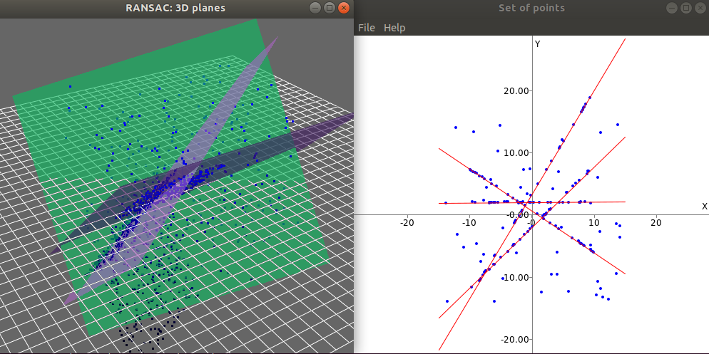
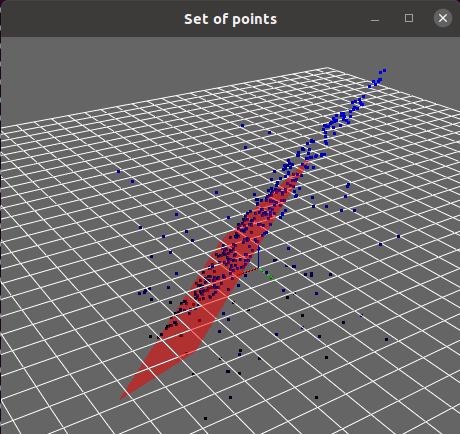

.. _tutorial-ransac:

===================================================================
RANSAC C++ examples
===================================================================

1. RANSAC algorithm
----------------------

Random sample consensus (RANSAC) was originally presented in the 
seminal work :cite:`fischler1981random` and is still widely used.
For a theoretical description of the algorithm, refer to 
:cite:`fischler1981random` or to 
`this Wikipedia article <https://en.wikipedia.org/wiki/Random_sample_consensus>`_
and the cites herein.

MRPT comprises a generic, template-based C++ implementation of this
robust model fit algorithm, useful for outliers rejection.
See also `this excellent MATLAB toolkit <https://www.peterkovesi.com/matlabfns/>`_
by Peter Kovesi, on which MRPT implementation is strongly based.

2. C++ API
----------------------

The base C++ API for RANSAC in MRPT
is `mrpt::math::RANSAC_Template <class_mrpt_math_RANSAC_Template.html>`_,
while some specialized classes exist for particular instances of common problems, 
e.g. fit a plane or a line to a point cloud, as shown below.

A simple genetic-like modification of RANSAC is also available 
through the template class `mrpt::math::ModelSearch <class_mrpt_math_ModelSearch.html>`_.

3. Particular applications
----------------------------

3.1. Fit a plane from 3D points
~~~~~~~~~~~~~~~~~~~~~~~~~~~~~~~~~~~~

Refer to the `example source code <page_math_ransac_plane3d_example2.html>`_ 
for a direct usage of the generic C++ RANSACA template to see how to define
custom models and test functions.

3.2. Fit many planes from 3D points
~~~~~~~~~~~~~~~~~~~~~~~~~~~~~~~~~~~~~

MRPT provides the following functions for detecting planes
(see `their C++ API documentation <group_ransac_grp.html#global-functions>`_
or the `complete example <page_math_ransac_examples.html>`_):

.. code-block:: cpp
   :caption: Fit planes C++ API

   template <typename NUMTYPE>
   void mrpt::math::ransac_detect_3D_planes(
       const CVectorDynamic<NUMTYPE>& x,
       const CVectorDynamic<NUMTYPE>& y,
       const CVectorDynamic<NUMTYPE>& z,
       std::vector<std::pair<size_t, TPlane>>& out_detected_planes,
       const double threshold,
       const size_t min_inliers_for_valid_plane = 10
       )
   
   template <class POINTSMAP>
   void mrpt::math::ransac_detect_3D_planes(
       const POINTSMAP* points_map,
       std::vector<std::pair<size_t, TPlane>>& out_detected_planes,
       const double threshold,
       const size_t min_inliers_for_valid_plane
       )

3.3. Fit 2D lines
~~~~~~~~~~~~~~~~~~~~~

MRPT provides the following function to detect lines
(see `their C++ API documentation <group_ransac_grp.html#global-functions>`_
or the `complete example <page_math_ransac_examples.html>`_):

.. code-block:: cpp
   :caption: Fit lines C++ API

   template <typename NUMTYPE>
   void mrpt::math::ransac_detect_2D_lines(
       const CVectorDynamic<NUMTYPE>& x,
       const CVectorDynamic<NUMTYPE>& y,
       std::vector<std::pair<size_t, TLine2D>>& out_detected_lines,
       const double threshold,
       const size_t min_inliers_for_valid_line = 5
       )

3.4. Data association with RANSAC
~~~~~~~~~~~~~~~~~~~~~~~~~~~~~~~~~~~

`This example <page_maps_ransac_data_association.html>`_ illustrates how RANSAC
can be used to establish the pairings (the "data association" problem)
between a set of 2D noisy observations and another set of 2D predictions from a map.
For example it could be used to match planar range-bearing landmarks against a 2D map, 
or a subset of image keypoints against a larger image mosaic.

This method was discussed in our paper :cite:`blanco2013robust`.

.. image:: maps_ransac_data_association_screenshot.png
	:alt: MRPT RANSAC data association screenshot

